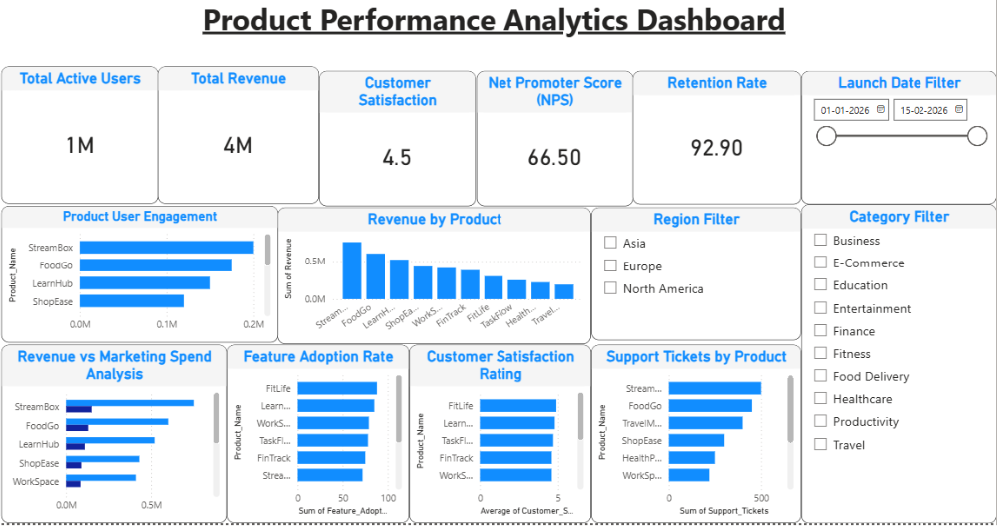

# Product Performance Analytics Dashboard

An interactive Power BI dashboard that analyzes product performance, customer engagement, revenue, marketing effectiveness, customer satisfaction, and key business KPIs.

---

## 📊 Dashboard Preview

---

## 📌 Project Overview

This Power BI dashboard provides insights into product performance by tracking key business metrics such as active users, revenue, customer satisfaction, Net Promoter Score (NPS), retention rate, feature adoption, marketing spend, and support tickets. Interactive filters enable users to explore data by launch date, region, and product category.

---

## 🎯 Key Performance Indicators (KPIs)

- Total Active Users
- Total Revenue
- Customer Satisfaction Score
- Net Promoter Score (NPS)
- Retention Rate

---

## 📈 Dashboard Features

- Product User Engagement Analysis
- Revenue by Product
- Revenue vs. Marketing Spend Analysis
- Customer Satisfaction Rating
- Feature Adoption Rate
- Support Tickets by Product
- Launch Date Filter
- Region Filter
- Category Filter

---

## 🛠️ Tools & Technologies

- Microsoft Power BI
- Microsoft Excel
- DAX (Data Analysis Expressions)
- Data Visualization
- Business Intelligence (BI)

---

## 📂 Repository Contents

- `Product_Performance_Analytics_Dashboard.pbix`
- `Product_Performance_Analytics_Dashboard.pdf`
- `Product_Performance_Analytics_Dashboard.png`
- `Product_Analytics_Dataset.xlsx`

---

## 💡 Skills Demonstrated

- Power BI Dashboard Development
- Data Visualization
- Business Intelligence
- KPI Reporting
- Data Analysis
- DAX
- Customer Analytics
- Product Analytics
- Microsoft Excel
- Interactive Dashboard Design

---

## 📊 Business Insights

- Identified products with the highest user engagement.
- Compared revenue generated by each product.
- Evaluated marketing spend against revenue performance.
- Monitored customer satisfaction and Net Promoter Score (NPS).
- Analyzed feature adoption across products.
- Tracked support ticket volume to identify products requiring additional customer support.
- Measured customer retention performance.
- Enabled interactive filtering by launch date, region, and product category.

---

## 🚀 Dashboard Highlights

- Interactive KPI Cards
- Dynamic Filters & Slicers
- Product Performance Analysis
- Revenue & Marketing Analysis
- Customer Experience Analytics
- Feature Adoption Insights
- Business Intelligence Dashboard

---

## 👨‍💻 Developed By

**Gopichand Kollapattu**

**Power BI | Data Analytics | Business Intelligence**
